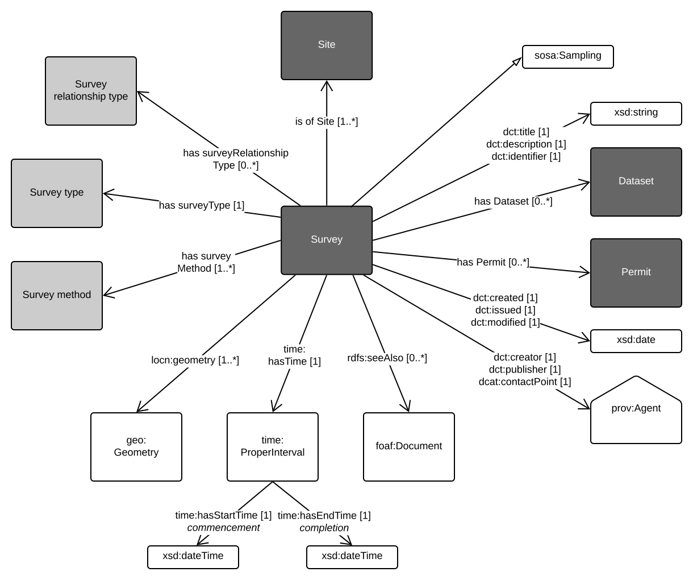
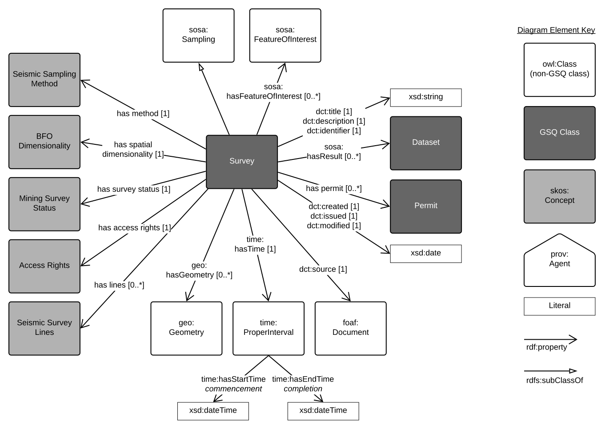

# GSQ Survey Profile
This profile describes the `survey` concept. 

GSQ uses `survey` to describe a temporal observation event. Within this model there are more detailed models of special kinds of `surveys`, such as `seismic surveys` for the acquisition of seismic data. Figure 1 below shows the basic properties of the generic `survey` class.

 
Figure 1: Survey profile

Figure 1. shows the template Survey profile used by GSQ.

## Profile resources
This profile is presented as a series of files that perform different roles:

1. [model/](model/) - the *model* folder contains this profile's models in both graphical (SVG) and machine-readable, textual, form ( [RDF](https://www.w3.org/RDF/) turtle).
2. [shapes/](shapes/) - folder containing SHACL shapes files used to validate data's conformance to this profile's model.
3. [profile.ttl](profile.ttl) - the profile declaration. A description of all of the items in this profile (the formal model, validating resources, documentation etc.) according to the W3C's [Profiles Ontology](https://www.w3.org/TR/dx-prof/) which describes how all the parts related to one another, the roles they play (to give *guidance* for use, to *validate* data etc.) and how this profile *profiles* the various standards listed above.

## GSQ classes
Classes used in this profile:
1. [GSQ Site](https://github.com/geological-survey-of-queensland/gsq-site-profile)
2. [GSQ Dataset](https://github.com/geological-survey-of-queensland/gsq-dataset-profile)
3. [GSQ Permit](https://github.com/geological-survey-of-queensland/gsq-permit-profile)

## OWL classes
1. [SOSA sampling](https://www.w3.org/TR/vocab-ssn/#SOSASampling)
2. [dct:title](https://w3c.github.io/dxwg/dcat/#Property:resource_title) - report title
3. [dct:description](https://w3c.github.io/dxwg/dcat/#Property:resource_description)
4. [dct:identifier](https://w3c.github.io/dxwg/dcat/#Property:resource_identifier) - report number 
5. xxx:alias
6. [dct:created](https://w3c.github.io/dxwg/dcat/)
7. [dct:issued](https://w3c.github.io/dxwg/dcat/#Property:resource_release_date) - date of formal issuance (e.g., open file publication)
8. [dct:modified](https://w3c.github.io/dxwg/dcat/#Property:resource_update_date) - most recent date on which the item was changed, updated or modified
9. [dct:creator](https://w3c.github.io/dxwg/dcat/#Property:resource_creator) - the author of the report
10. [dct:publisher](https://w3c.github.io/dxwg/dcat/#Property:resource_publisher) - GSQ
11. [dct:contactPoint](https://w3c.github.io/dxwg/dcat/#Property:resource_contact_point) - GSQ contact
12. [prov:Agent](http://https://www.w3.org/TR/prov-o/#Agent)
13. [rdfs:seeAlso](https://www.w3.org/TR/rdf-schema/#ch_seealso) - refers to secondary metadata
14. [FOAF document](http://xmlns.com/foaf/spec/#term_Document) - a document with secondary metadata
15. [time:properInterval](https://www.w3.org/TR/owl-time/#time:Interval)
16. [time:hasStartTime](https://www.w3.org/TR/owl-time/#time:hasBeginning)
17. [time:hasEndTime](https://www.w3.org/TR/owl-time/#time:hasBeginning)
18. [locn:geometry](http://www.w3.org/ns/locn#geometry) - spatial coverage of the report expressed as lat/long, centroid, bounding box or simple polygon

## [Distribution](https://w3c.github.io/dxwg/dcat/#Class:Distribution) properties not shown in the diagram:
No distribution properties for Survey template

## Vocabularies
1. [Survey relationship type](https://vocabs.gsq.digital/vocabulary/survey-relationship-type)
2. [Survey type](https://vocabs.gsq.digital/vocabulary/survey-type)
3. [Survey method](https://vocabs.gsq.digital/vocabulary/survey-method)

## Seismic Survey
Seismic survey is a specialised survey.

   
Figure 2: Seismic Survey profile
   

*author*:  
**Your Name**  
*Your Role Title - Your Unit*  
Geological Survey of Queensland  
<your.email@dnrme.qld.gov.au>
