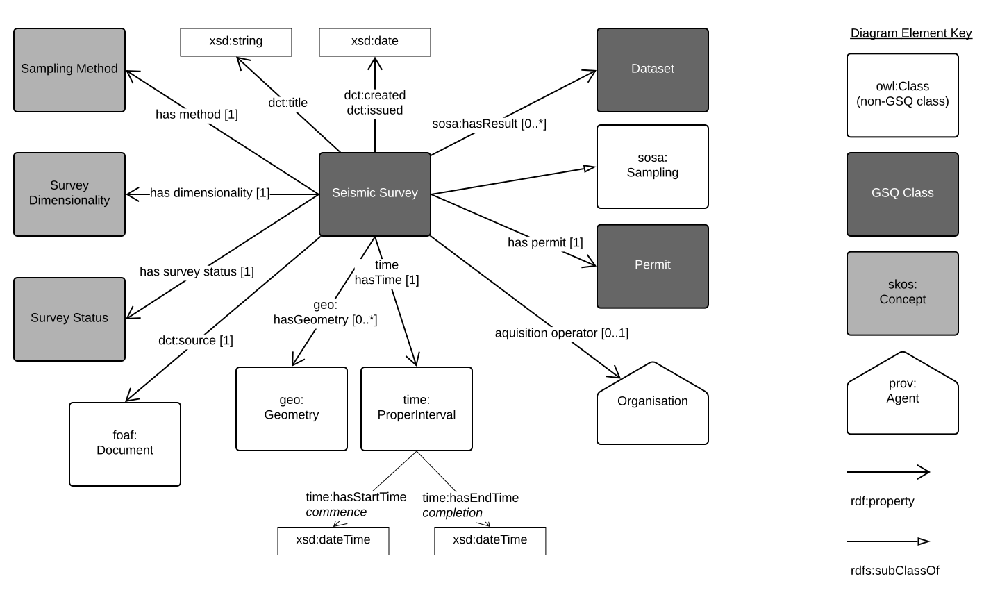
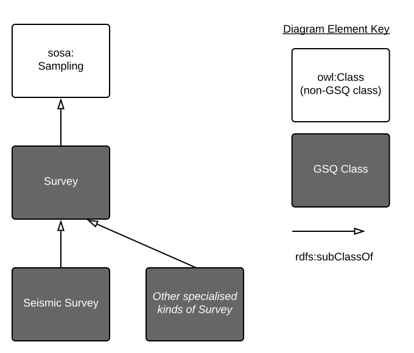

# GSQ Survey Profile
This is a generic model of a *survey* - a temporal observation event. Within this model are more detailed models of special kinds of `Surveys`, such as `Seismic Surveys`, for the aquisition of seismic data. Figure 1 below shows the basic properties of the generic `Survey` class. 

  

**Fig. 1**: The GSQ Survey object and its direct properties  

The sepcialised surveys and their relation to `Survey` are given in Figure 2.

  

**Fig. 2**: Survey hierarchy  

## Profile contents
The contents of this profile - files within this repository - are:

1. [model/](model/) - folder containing image and machine-redable versions of this profile's models
2. [shapes/](shapes) - folder containing [SHACL](https://www.w3.org/TR/shacl/) *shapes* files used to validate data's conformance to this profile's model
3. [profile.ttl](profile.ttl) - the formal description of this Profile according to the [The Profiles Vocabulary](https://www.w3.org/TR/dx-prof/).

## GSQ classes
CLasses used in this profile:
1. [Queensland Mining Permits](https://github.com/geological-survey-of-queensland/gsq-permit-profile)
2. [Dataset](https://github.com/geological-survey-of-queensland/gsq-dataset-profile)

## OWL classes
1. [SOSA sampling](https://www.w3.org/TR/vocab-ssn/#SOSASampling)
2. [SOSA feature of interest](https://www.w3.org/TR/vocab-ssn/#SOSAFeatureOfInterest)
3. [FOAF document](http://xmlns.com/foaf/spec/#term_Document) - used to capture the secondary metadata in JSON format
4. [Geometry](https://www.w3.org/2003/01/geo/)
5. [ProperInterval](https://www.w3.org/TR/owl-time/#time:ProperInterval)

## Vocabularies
The vocabularies used in this profile are:
1. [Seismic Sampling Method](http://vocabs.gsq.digital/vocabulary/seismic-sampling-method)
2. [BFO Dimensionality](http://vocabs.gsq.digital/vocabulary/spatial-region) - [Basic Formal Ontology](https://github.com/bfo-ontology/BFO/wiki) spatial region
3. [Mining Survey Status](http://vocabs.gsq.digital/vocabulary/mining-survey-status)
4. [Data Access Rights](http://vocabs.gsq.digital/vocabulary/data-access)

## License
The content of this repository is licensed for use with the [Creative Commons 4.0 License](https://creativecommons.org/licenses/by/4.0/). See the [license deed](LICENSE) for details.

## Contacts 
*owner*:  
**Mark Gordon**  
*Director - Geoscience Information*  
Geological Survey of Queensland  
<mark.gordon@dnrme.qld.gov.au>   

*author*:  
**Nicholas Car**  
*Senior Experimental Scientist*  
CSIRO Land & Water, Environmental Informatics Group  
<nicholas.car@csiro.au>
